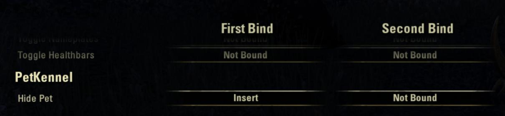
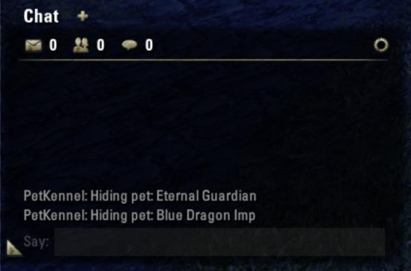

PetKennel automatically dismisses pets when doing errands in town.

# System Requirements:

- Required, install separately: [LibCraftText](https://www.esoui.com/downloads/info2184-LibCraftText.html)

# Why PetKennel?

- Sick of Twilight Matriarchs flap-flap-flapping in your face when trying to craft?
- Wish you could automatically put away your warden's bear when you walk up to a daily writ turn-in crate?
- Have you ever apologized in chat for your pets interfering with other players doing their daily crafting writs?
- Wish you could dismiss pets with a single keystroke?

PetKennel automatically dismisses your combat and vanity pets upon common in-town interactions:

- daily crafting writ board
- crafting station
- crafting writ turn-in crate
- (non-assistant) bank
- (non-assistant) merchants and guild traders
- Rolis Hlaalu

By popular demand, PetKennel can also automatically dismiss your pets (usually just non-combat pets!) when you're out in the field:

- dungeons & delves

### KeyBinding

PetKennel also adds a keybinding to "Hide Pet".

### Chat Output

PetKennel writes to chat when it dismisses your pet(s).

# Options

If for some reason you _want_ your big opaque bear to get in everybody's way, you can choose to disable PetKennel for whichever interaction you want to keep your pet active.

# To Do

- Assistants? It's amusing to see Tythis and Nuzhimeh chasing after crafters as they do their daily writs. Should I hide them?
- No, there is no way to force _other_ players to dismiss _their_ pets. Perhaps politely ask them to install PetKennel?.

# Thank You

Originally inspired by [Dolgubon's Lazy Writ Crafter](https://www.esoui.com/downloads/info1346-DolgubonsLazyWritCrafter.html) which implements this same feature, but restricted to only when crafting writs. Some pet-hiding code copied verbatim from LazyWritCrafter.

# Follow development on GitHub

[ESO-PetKennel on GitHub](https://github.com/ziggr/ESO-PetKennel)

