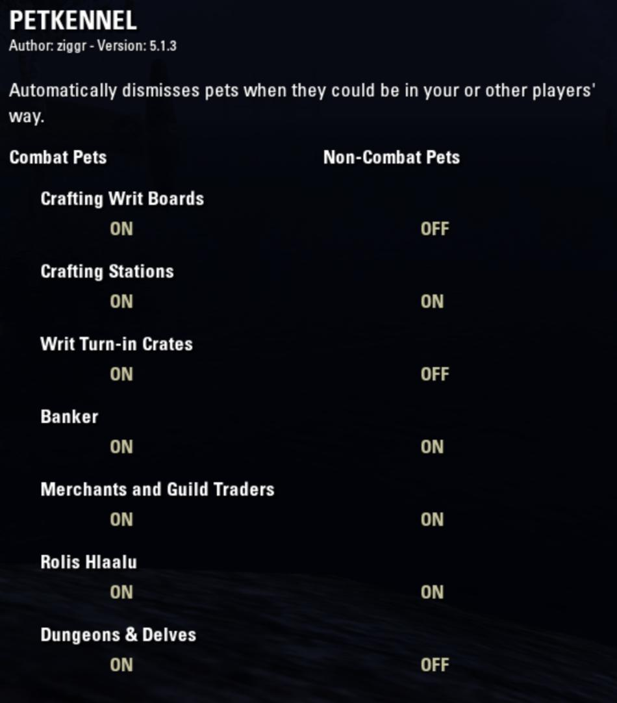

PetKennel automatically dismisses combat pets when doing errands in town.

# System Requirements:

- Required, install separately: [LibCraftText](https://www.esoui.com/downloads/info2184-LibCraftText.html)

# Why PetKennel?

- Sick of Twilight Matriarchs flap-flap-flapping in your face when trying to craft?
- Wish you could automatically put away your warden's bear when you walk into a bank?
- Have you ever apologized in chat for your pet interfering with other players doing their daily crafting writs?
- Wish you could dismiss a pet with a single keystroke?

PetKennel automatically dismisses your combat pet upon common in-town interactions:

- daily crafting writ board
- crafting station
- crafting writ turn-in crate
- (non-assistant) bank
- (non-assistant) merchant
- Rolis Hlaalu

### KeyBinding

PetKennel also adds a keybinding to "Hide Pet".

### Chat Output

PetKennel writs to chat when it dismisses your pet.

# Options

If for some reason you _want_ your big opaque bear to get in everybody's way, you can choose to disable PetKennel for whichever interaction you want to keep your pet active.

# Todo

- **Collectible pets:** Figure out how to detect and dismiss all those floating baby netches and blue dragon imps.

# Thank You

Originally inspired by [Dolgubon's Lazy Writ Crafter](https://www.esoui.com/downloads/info1346-DolgubonsLazyWritCrafter.html) which implements this same feature, but restricted to only when crafting writs. Some pet-hiding code copied verbatim from LazyWritCrafter.

# Follow development on GitHub

[ESO-PetKennel on GitHub](https://github.com/ziggr/ESO-PetKennel)

--Z
